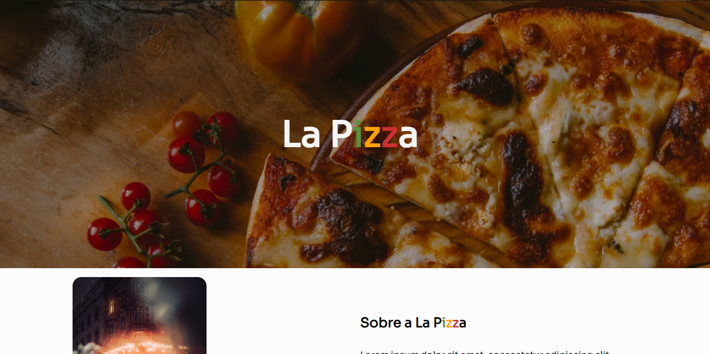
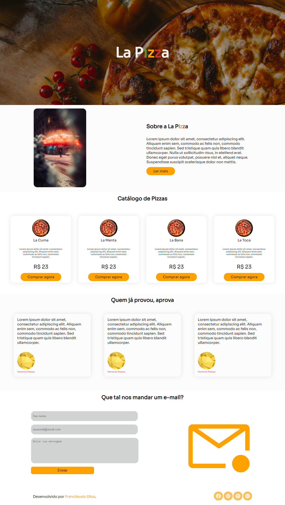

 
&#xa0;
 
<a href='linkdosite'>Demo</a>
 

 
<h1 align='center'>La Pizza | Landing Page de Estudos</h1>
 

 

 

 

 

<a href='#dart-sobre'>Sobre</a> &#xa0; | &#xa0;
<a href='#memo-licença'>Licença</a> &#xa0; | &#xa0;
<a href='https://github.com/fransilva0' target='_blank'>Autor</a>

 
 
 
## :dart: Sobre ##
 
O Projeto da construção da Landing Page veio do desafio 12 da Codelândia onde aproveitei o nome da pizzaria fictícia e a ideia da Landing Page, porém realizei mudanças na minha página como a adição da seção de depoimentos e a barra de links sociais.

Utilizei a biblioteca ScrollReveal para adicionar a animação de aparecimento de elementos ao dar scroll (rolagem) na página. Também trabalhei na responsividade da página para o desktop. 

 
## :memo: Licença ##
 
Este projeto está sob licença MIT. Veja o arquivo [LICENSE](LICENSE.md) para mais detalhes.
 
 
Feito com :heart: por <a href='https://github.com/fransilva0' target='_blank'>Francileudo Oliveira</a>
 
&#xa0;

&#xa0;
 
<a href='#top'>Voltar para o topo</a>